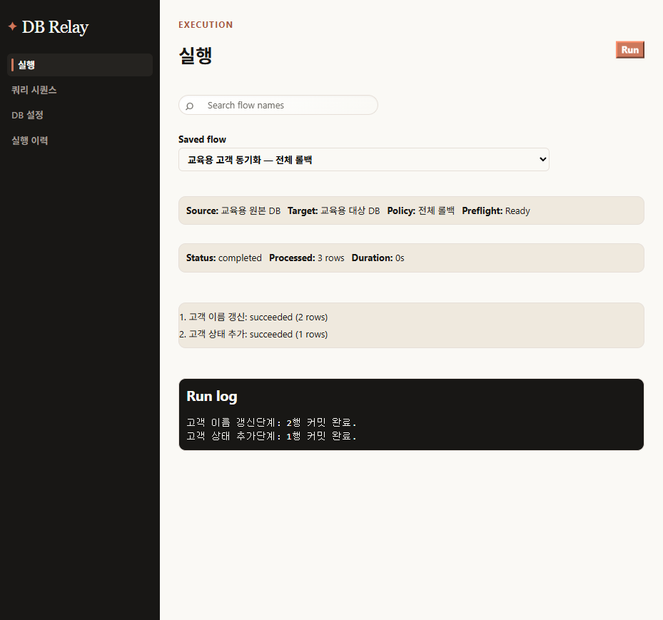
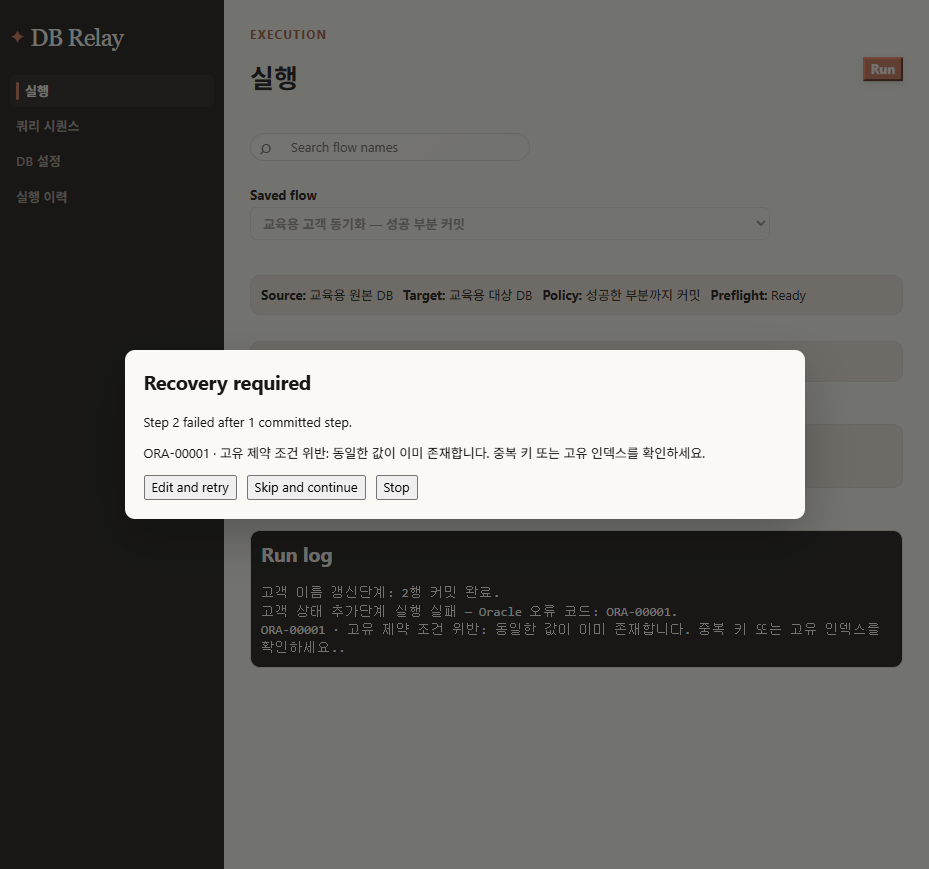

# DB Relay 사용자 매뉴얼

DB Relay는 Oracle 원본 DB의 조회 결과를 대상 DB의 Insert, Update, Upsert 작업으로 옮기는 Windows 데스크톱 도구입니다. 연결과 플로우를 저장해 반복 실행할 수 있으며, 실행 이력과 단계별 복원 기능을 제공합니다.

> 이 문서의 화면은 교육용 가상 연결과 가상 고객 데이터로 촬영했습니다. 비밀번호, 실제 접속 문자열, 바인드 값, 원본 행 데이터는 화면 캡처나 문서에 저장하지 마세요.

## 1. 시작하기

### 준비 사항

- Windows에서 DB Relay를 실행합니다.
- 원본 Oracle 계정에는 필요한 테이블의 `SELECT` 권한만 부여하세요. DB Relay가 원본 DB를 강제로 읽기 전용으로 만들지는 않습니다.
- 대상 Oracle 계정에는 실행할 Insert, Update, Merge에 필요한 최소 권한만 부여하세요.
- 운영 DB에서 처음 실행하기 전에는 별도 테스트 데이터로 플로우와 SQL을 검증하세요.

### 화면 구성

왼쪽 메뉴에서 다음 화면을 엽니다.

- **실행**: 저장한 플로우를 선택해 실행하고 진행 상태와 로그를 확인합니다.
- **쿼리 시퀀스**: 플로우와 단계별 Source SQL·Target SQL을 만듭니다.
- **DB 설정**: 원본·대상 Oracle 연결을 등록하고 시험합니다.
- **실행 이력**: 과거 실행의 상태, 단계 결과, 오류, 복구 선택을 봅니다.

## 2. DB 연결 등록

1. **DB 설정**에서 새 연결을 만듭니다.
2. 표시 이름, 호스트, 포트, SID, 사용자 이름, 비밀번호를 입력합니다.
3. **연결 시험**으로 접속 가능 여부를 확인합니다.
4. 저장한 연결은 플로우에서 원본 또는 대상으로 선택합니다.

저장 후 화면에는 비밀번호 대신 같은 길이의 마스크만 표시됩니다. 오류·실행 이력·로그에도 비밀번호와 연결 문자열 전체를 남기지 않습니다.

## 3. 플로우와 단계 만들기

플로우는 원본 연결, 대상 연결, 트랜잭션 정책, 정렬된 하나 이상의 단계로 구성됩니다.

1. **쿼리 시퀀스**에서 플로우를 새로 만들거나 기존 플로우의 **Edit**을 선택합니다.
2. 원본과 대상을 서로 다른 연결로 선택합니다.
3. 단계별로 **Source SQL**과 **Target SQL**을 입력합니다.
4. 실행 정책을 고릅니다.
   - **전체 롤백**: 어느 단계라도 실패하면 대상 DB의 이번 실행 변경을 모두 롤백합니다.
   - **성공한 부분까지 커밋**: 성공한 단계는 즉시 커밋합니다. 실패한 단계는 사용자가 수정 후 재시도, 건너뛰기, 중지 중 하나를 선택합니다.
5. 플로우를 저장합니다.


Source SQL의 첫 SELECT 열을 기준으로 Insert, Update, Upsert용 Target SQL 초안을 만들 수 있습니다. 생성 SQL은 초안이므로, 실제 대상 테이블의 키와 업무 규칙에 맞게 반드시 검토하세요.

### 3.1 실행 정책: 전체 롤백과 성공한 부분까지 커밋

실행 정책은 **Flow 전체 실행**에 적용됩니다. Edit Flow의 **Run**은 현재 단계 하나만 실행하므로, 이 정책별 복구 대화상자는 왼쪽 메뉴의 **실행** 화면에서 저장된 Flow를 실행할 때 나타납니다.

| 정책 | 실패 시 결과 | 실행 뒤 확인·후속 조치 |
| --- | --- | --- |
| **전체 롤백** | 하나라도 실패하면 이번 Flow 실행이 대상으로 적용한 변경을 하나의 트랜잭션으로 모두 롤백합니다. 성공했던 앞 단계도 대상 DB에 남지 않습니다. | 실행 로그에서 실패 단계와 Oracle 오류를 확인하고, SQL·바인드 매핑·권한·대상 데이터 조건을 고친 뒤 Flow 전체를 다시 실행합니다. 부분 성공분을 따로 정리할 필요는 없습니다. |
| **성공한 부분까지 커밋** | 각 단계의 성공 결과가 즉시 커밋됩니다. 이후 단계가 실패하면 앞 단계의 결과는 남고, 실패 단계에서 복구 결정을 기다립니다. | 먼저 대상 DB에서 이미 커밋된 단계의 영향 범위를 확인합니다. 그 뒤 **수정 후 재시도**, **건너뛰고 계속**, **중지** 중 하나를 명시적으로 선택합니다. |

전체 롤백은 여러 단계가 함께 성공해야 하는 일괄 반영에 적합합니다. 성공한 부분까지 커밋은 오래 걸리는 Flow에서 앞 단계 결과를 보존할 수 있지만, 실패 뒤의 운영 판단과 데이터 확인이 필요합니다.

## 4. Edit Flow: 미리보기, 수정, Run

### 4.1 단계 편집 화면

각 단계에는 제목, Operation, Source SQL, Target SQL과 **미리보기**, **Run**, **복원** 버튼이 있습니다. 처음에는 복원할 실행이 없으므로 **복원**은 비활성입니다.


### 4.2 미리보기

**미리보기**는 현재 Source SQL을 원본 연결에서 실행해 반환 예정 열과 행을 보여 줍니다. 대상 DB에는 어떤 DML도 실행하지 않습니다.

1. Source SQL을 검토한 뒤 **미리보기**를 누릅니다.
2. 표의 셀을 직접 수정할 수 있습니다.
3. 수정 내용을 Run에 쓰려면 **저장**을 누릅니다. 저장하지 않고 **닫기**를 누르면 수정본은 사용되지 않습니다.


저장된 미리보기는 다음 경우 즉시 폐기됩니다.

- 미리보기 모달을 닫을 때(저장하지 않은 미리보기)
- 새 미리보기를 열어 기존 미리보기가 바뀔 때
- Source SQL, Target SQL, 원본 연결, 대상 연결을 바꿀 때
- 단계 실행을 시작할 때(저장본은 그 한 번의 Run에만 사용)
- Edit Flow 화면을 닫거나 앱을 다시 시작할 때

미리보기 행은 메모리에만 잠시 존재합니다. SQLite, 실행 이력, 로그, IPC 응답의 일반 DTO에는 저장하지 않습니다.

### 4.3 Run

Run은 현재 단계만 실행합니다. 원본·대상 연결과 두 SQL이 모두 있어야 활성화됩니다. 미리보기를 저장했다면 Run은 원본을 다시 조회하지 않고 저장한 편집본을 사용합니다.

Run 전에는 Target SQL의 이름 있는 바인드가 Source SQL의 열과 올바르게 연결되는지 검사합니다. 누락·중복·모호한 매핑은 대상 트랜잭션을 시작하기 전에 차단됩니다.

저장한 미리보기 값을 실행할 때는 대상 Oracle 컬럼의 타입도 확인합니다. `NUMBER`, `FLOAT`, `BINARY_FLOAT`, `BINARY_DOUBLE` 대상 컬럼에 연결된 이름 있는 바인드는 안전하게 숫자로 변환되고, 안전한 JavaScript 정수 범위를 넘는 정수는 큰 정수로 전달됩니다. 그 밖의 타입은 문자열로 전달되며 빈 셀은 `null`로 유지됩니다. 대상 컬럼 정보를 완전히 확인할 수 없으면 원래의 문자열·`null` 값을 그대로 사용합니다. 숫자 컬럼에 숫자로 해석할 수 없는 값을 입력하면 대상 DML을 시작하기 전에 실행이 거부됩니다. 이 변환은 저장한 미리보기의 이름 있는 바인드에만 적용되며 SQL 리터럴에는 적용되지 않습니다.

### 4.4 Target SQL 가이드

Operation을 Insert, Update, Upsert로 바꾸면 DB Relay는 **단순한 Source SELECT**를 읽어 Target SQL 초안을 만듭니다. 예를 들어 다음 Source SQL이라면 첫 열 `CUSTOMER_ID`를 Update의 `WHERE` 조건 또는 Upsert의 `ON` 조건 후보로 사용하고, SELECT 열 이름을 이름 있는 바인드로 만듭니다.

```sql
SELECT CUSTOMER_ID, CUSTOMER_NAME FROM CUSTOMERS

UPDATE CUSTOMERS
SET CUSTOMER_NAME = :CUSTOMER_NAME
WHERE CUSTOMER_ID = :CUSTOMER_ID
```

- 초안은 `SELECT ... FROM 테이블`의 한 테이블·식별자 열 목록을 기준으로 생성합니다. 열에 별칭을 쓸 수 있으며, 바인드 이름에는 그 별칭이 사용됩니다.
- 생성기는 Source SQL의 `FROM` 테이블 이름을 Target 테이블의 초기값으로도 사용합니다. 원본과 대상 테이블 이름이 다르면 반드시 `INSERT INTO`, `UPDATE`, `MERGE INTO`의 대상 테이블을 바꾸십시오.
- Update와 Upsert의 첫 SELECT 열은 **후보일 뿐**입니다. 실제 대상 테이블의 PK/UK(기본키·고유키), 복합 키, 테넌트 조건 등에 맞게 `WHERE` 또는 `ON` 조건을 검토하고 수정해야 합니다.
- Upsert 초안의 `WHEN MATCHED`는 갱신, `WHEN NOT MATCHED`는 삽입입니다. 안내 주석에도 이 구분과 ON 조건 검토 필요성이 표시됩니다.
- 함수, 조인, 서브쿼리, 계산식처럼 단순 SELECT로 해석할 수 없는 Source SQL은 자동 초안을 만들지 못할 수 있습니다. 이 경우 Target SQL을 직접 작성하고, 각 `:바인드명`이 Source SELECT의 열 또는 별칭과 정확히 한 번씩 대응하는지 확인하십시오.
- 편집 중에는 SQL 편집기에 포커스를 둔 뒤 `Ctrl+F`로 형식을 정리할 수 있습니다. 가이드는 실행 가능한 SQL을 대신 검증하지 않으므로, 운영 실행 전에는 전용 테스트 데이터로 미리보기와 Run을 확인하는 것이 안전합니다.

## 5. 복원: 지원 조건과 동작

**복원**은 일반적인 SQL 되돌리기가 아닙니다. Edit Flow에서 방금 성공적으로 커밋한, 지원되는 한 단계의 변경만 짧은 시간 동안 안전하게 되돌리는 기능입니다.

### 5.1 복원 버튼이 활성화되는 조건

다음 조건을 모두 만족해야 Run 뒤에 **복원**이 활성화됩니다.

1. 해당 단계의 Run이 성공적으로 커밋되어야 합니다.
2. 처리 행이 있어야 합니다. 0건 성공은 오류가 아니지만 복원 기록을 만들지 않습니다.
3. Target SQL이 다음의 제한된 형식 중 하나여야 합니다.
   - 단일 테이블 직접 Insert: `INSERT INTO 테이블 (열, ...) VALUES (:바인드, ...)`
   - 단일 테이블 Update: `UPDATE 테이블 SET 열 = :바인드 ... WHERE 키 = :키 [AND 키 = :키 ...]`
   - 편집기가 생성한 형태의 단순 Oracle Merge(Upsert): `USING (SELECT ... FROM dual)`과 `ON (target.키 = source.키 [AND ...])`를 사용하는 형식
4. 현재 Edit Flow 세션과 단계 설정이 그대로여야 합니다.

아래 화면에서는 교육용 Update가 성공해 2행을 처리했고, **복원** 버튼이 활성화된 상태입니다.


### 5.2 복원은 무엇을 되돌리나

- **Insert**: 이 Run이 새로 삽입한 행만 Oracle `ROWID`로 찾아 삭제합니다.
- **Update**: Run 전에 기억한 해당 행의 이전 값을 다시 씁니다.
- **Upsert/Merge**: 이번 Run에서 새로 삽입된 행은 삭제하고, 기존 행의 갱신분은 이전 값으로 되돌립니다.

각 복원은 대상 DB의 하나의 트랜잭션으로 실행됩니다. 모든 대상 행을 안전하게 되돌릴 수 있을 때만 커밋합니다. 일부만 복원하는 일은 없습니다.

### 5.3 복원이 지원되지 않는 경우

아래 Target SQL은 **실행은 가능하지만 복원 기록을 만들지 않습니다**.

- `INSERT ... SELECT`, `INSERT ALL`, 여러 테이블 DML
- 이미 `RETURNING` 절을 가진 Insert
- `OR`, 함수, 조인, 서브쿼리, 리터럴 조건, 부등호 같은 단순 동등식 이외의 WHERE/ON 조건
- 키를 바꾸는 Update 또는 여러 행을 모호하게 매치할 수 있는 SQL
- 편집기가 생성한 단순 Merge 형식에서 벗어난 임의 MERGE

이 제한은 임의 SQL을 추측해 되돌리다가 다른 데이터를 덮어쓰는 일을 막기 위한 안전 장치입니다.

### 5.4 복원 기록이 사라지는 경우

복원 기록은 영구 이력이 아니라 메인 프로세스 메모리의 일회성 권한입니다. 다음 경우 버튼이 다시 비활성화됩니다.

- 같은 단계에서 새 Run을 시작할 때(기존 기록을 먼저 폐기)
- Source SQL, Target SQL, Operation, 원본/대상 연결을 변경할 때
- 단계를 삭제할 때
- Edit Flow 또는 앱을 닫거나 앱을 재시작할 때
- 복원이 성공적으로 커밋됐을 때

단계마다 기록은 독립적입니다. Step A를 다시 실행해도 Step B가 별도로 만든 복원 기록은 유지됩니다.

### 5.5 복원 실패와 재시도

복원 시 대상 연결이 비활성·누락·호환 불가 상태이거나, 대상 행이 다른 작업으로 바뀌었거나, Oracle 오류가 나면 복원은 롤백됩니다. 이 경우 복원 기록은 지우지 않으므로 연결 또는 충돌 원인을 해결한 뒤 다시 시도할 수 있습니다.

다만 테이블 이동·재구성 등으로 Oracle `ROWID`가 더 이상 유효하지 않을 수 있고, 트리거·시퀀스·자율 트랜잭션처럼 직접 대상 행 밖에서 일어난 부수 효과는 복원하지 못합니다. 운영 환경에서는 복원 전후 대상 데이터를 확인하세요.

성공하면 버튼이 다시 비활성화되고 완료 상태가 표시됩니다.


## 6. 실행 화면: 상태, Run log, 실패 후 조치

왼쪽 메뉴의 **실행**에서 저장된 Flow를 선택하면 Source, Target, 실행 정책, Preflight 상태를 먼저 확인할 수 있습니다. Source·Target 연결이 활성화되어 있고 모든 단계에 Source SQL과 Target SQL이 있어야 **Run**이 활성화됩니다.

실행이 끝나면 화면은 상태(Status), 처리 행 수(Processed), 실행 시간(Duration), 단계별 결과를 보이고, 아래 **Run log**는 시간순으로 안전한 실행 이벤트를 표시합니다.



Run log에는 다음 내용이 표시됩니다.

- 성공 단계: 단계 이름, 영향 행 수, 커밋 완료 여부
- 실패 단계: 단계 이름, Oracle 오류 코드와 사람이 읽을 수 있는 안전한 안내
- 트랜잭션 실패: 전체 트랜잭션 수준에서 실패한 경우의 오류
- 복구 결정: 수정 후 재시도, 건너뛰고 계속, 중지 중 선택한 조치

로그와 실행 이력에는 Source 행 원문, Target SQL 본문, 바인드 값, 연결 문자열, 비밀번호가 표시되지 않습니다. 오류 조사에는 단계 제목·오류 코드·처리 행 수를 사용하고, SQL과 실제 데이터는 권한이 있는 환경에서 별도로 확인하십시오.

### 6.1 전체 롤백 정책의 후속 조치

완료 상태이면 모든 단계가 함께 커밋된 것입니다. 실패 또는 롤백 상태이면 이 Flow 실행이 대상 DB에 만든 변경은 남지 않습니다. 다음 순서로 처리하십시오.

1. Run log에서 실패 단계와 Oracle 오류 코드를 확인합니다.
2. 대상 테이블의 키 조건, 제약 조건, 권한, 데이터 형식과 Target SQL의 바인드 매핑을 점검합니다.
3. Edit Flow에서 SQL을 고치고 필요한 경우 미리보기로 Source 결과를 다시 확인합니다.
4. Flow 전체를 다시 실행합니다. 전체 롤백 정책에서는 실패 뒤에 개별 단계 건너뛰기나 재시도 대화상자가 열리지 않습니다.

### 6.2 성공한 부분까지 커밋 정책의 후속 조치

이 정책에서 단계가 실패하면 이미 성공한 단계는 되돌아가지 않고, 실행 화면에 **Recovery required** 대화상자가 열립니다. 아래 예시는 1단계가 커밋된 뒤 2단계가 ORA-00001 오류로 멈춘 상태입니다.



- **Edit and retry(수정 후 재시도)**: Source SQL과 Target SQL을 수정한 뒤 실패한 현재 단계를 다시 실행합니다. 대상 DB에서 이미 커밋된 앞 단계는 유지됩니다. 오류 원인이 키·제약·형식·매핑인지 확인하고, 재시도 전에 중복 실행이 안전한 SQL인지 검토하십시오.
- **Skip and continue(건너뛰고 계속)**: 현재 실패 단계의 데이터는 처리하지 않은 채 다음 단계로 갑니다. 왜 건너뛰었는지 기록하고, 미처리 범위를 별도 점검·보정한 뒤 필요하면 해당 단계를 새 Flow 실행으로 다시 처리하십시오.
- **Stop(중지)**: 더 이상 다음 단계를 실행하지 않습니다. 앞에서 커밋된 결과는 대상 DB에 그대로 남습니다. 커밋된 범위와 미처리 범위를 확인한 다음, 원인을 해결해 새 실행을 계획하거나 필요한 경우 별도의 보정 작업을 수행하십시오.

복구 대화상자가 떠 있는 동안에는 같은 Flow를 다시 실행하거나 다른 Flow로 바꾸지 말고, 한 가지 복구 결정을 완료한 뒤 결과 로그를 확인하십시오. 특히 건너뛰기와 중지는 전체 롤백이 아니므로, 운영 변경 기록에 커밋된 단계와 미처리 단계를 함께 남기는 것이 좋습니다.

## 7. 실행 이력과 안전한 문제 해결

실행 이력에서는 플로우 이름·버전, 원본/대상 표시 이름, 시작·종료 시각, 단계 상태, 처리 건수, 오류 코드와 복구 결정을 확인할 수 있습니다. 이력에는 비밀번호, SQL 본문, 바인드 값, 원본 행이 저장되지 않습니다.

Oracle 오류는 가능한 한 한글 안내로 표시됩니다. 연결·권한·리스너·SQL 형식 문제는 오류 코드와 함께 확인하고, 원본 DB와 대상 DB 계정 권한을 분리해 운영하세요.

## 8. 배포 및 문서 위치

이 매뉴얼은 GitHub에서 다음 경로로 볼 수 있습니다.

- `docs/user-guide.md`
- `docs/user-guide/assets/`

릴리스 설치 파일은 `pnpm package`로 만들며, 로컬 `release/` 폴더에 생성됩니다. `release/`는 빌드 산출물이므로 GitHub 소스 저장소에는 포함하지 않습니다.
